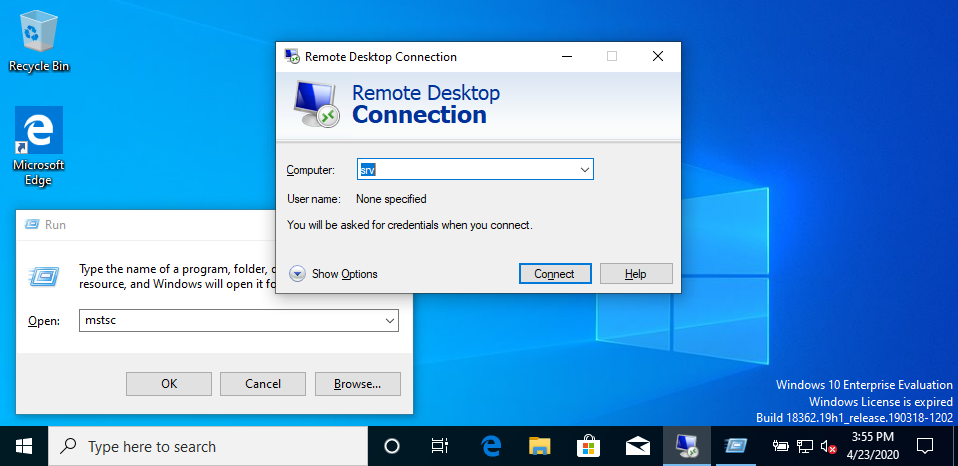
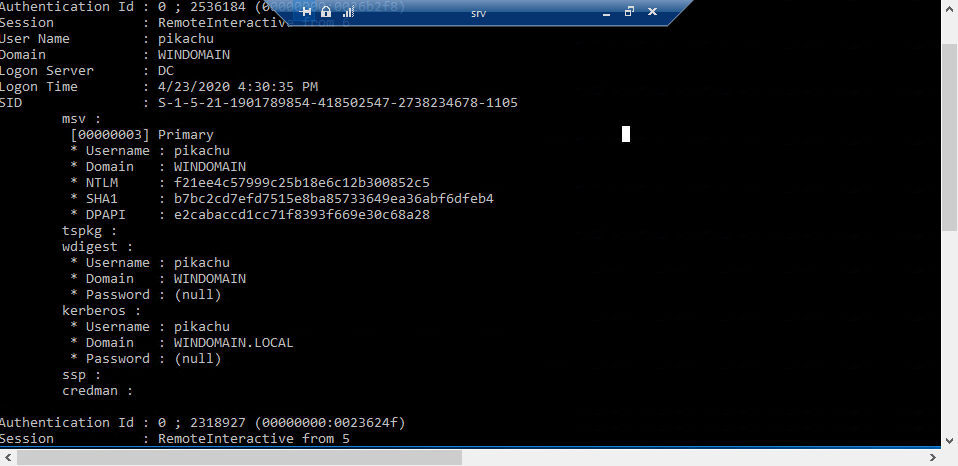
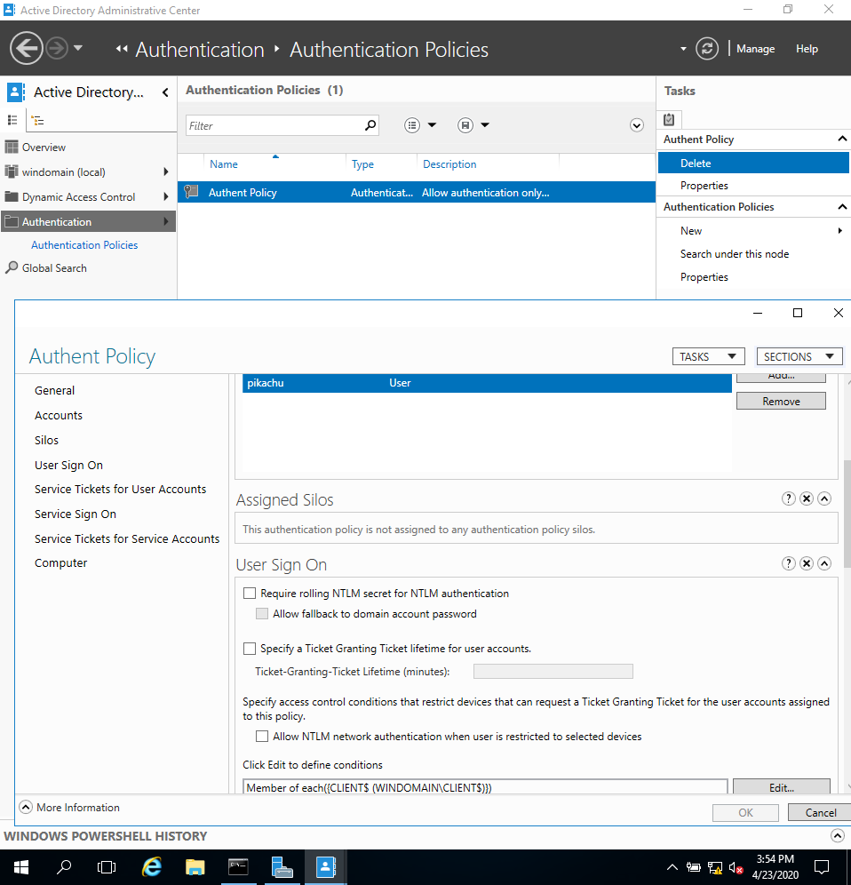
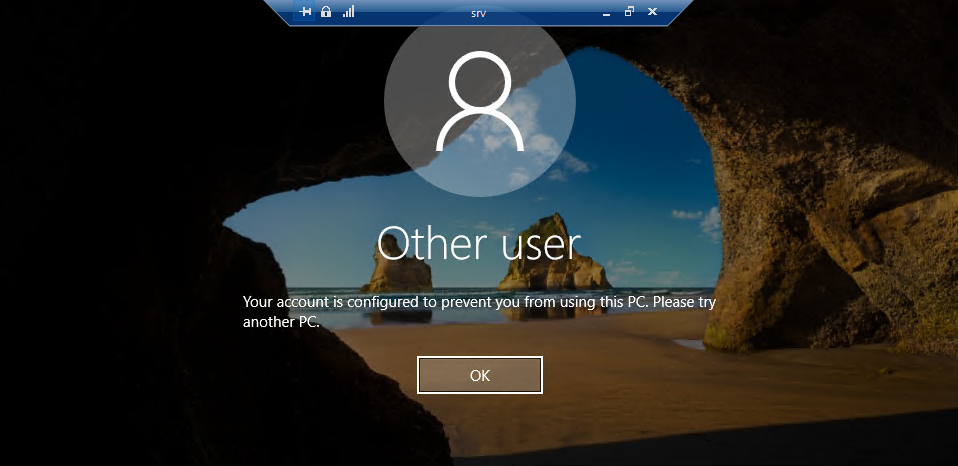
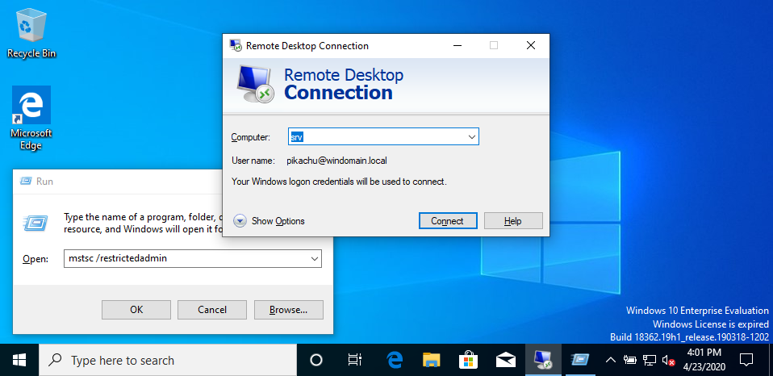
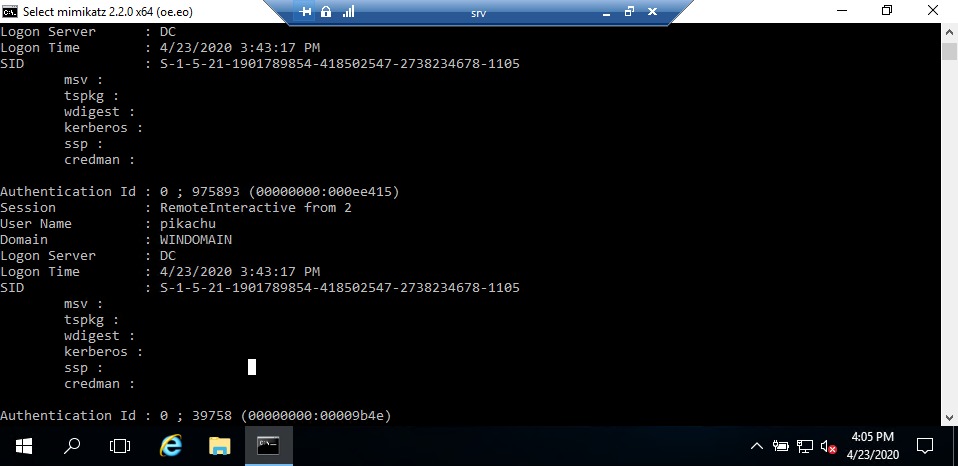
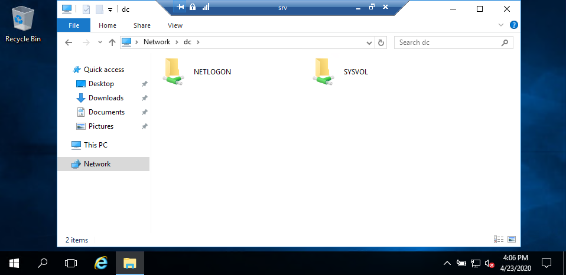

Tier-1 Administration through RestrictedAdmin lab
=

Objective
-

In the tier model, admnistration of Tier-0 is generally well understood: restrictive admin station (Privileged Access Workstations, PAW), and a Tier-0 with only essential elements for the domain. This setup can be enforced with Authentication Policies, and even implemented using Authentication Policies Silos.

Coming to the Tier-1, the question is: *how to administrate a machine potentially already compromised? Is it possible to have an administration method which do not imply the compromission of the Tier-1 when one of its machine is compromised?*

One of the answer to these questions resides in the use of administration methods which do not give additional access to an attacker controlling a machine to be administrated.
It includes avoid leaking credentials (like NTLM + RDP), or the possibility to access additional assets by hijacking a session (like Remote Credential Guard). Also, "Protected Users" is not a complete solution on its own: authentication credentials can still be retrieved if the administrator gives them (for remote access, when locking his session [1]).

The method which should be preferred is to only use remote tools that use network logons (type 3). However, one sometimes needs an interactive access for administrative task.
A common method is to use a local account, with a solution like LAPS (Local Administrator Password Solution). Indeed, an attacker root on the machine will only get back a local account - no gain. Unfortunately, a local account is unable to get or connect to network resources.

Here is where the solution illustrated in this lab come into light. One can use the RestrictedAdmin with RDP: the authentication is now NLA (Network-Level Authentication) only, and if the user is considered as an administrator of the target machine, it will connect and have the network token of the `TARGET_MACHINE$`. Hijacking this session only provides the access to the machine account on the domain, something someone root on the target machine already has.

But this time, this session can connect to remote shares and services, with the `TARGET_MACHINE$` account.
In addition, an AuthenticationPolicy (with NTLM disabled) can be set to only authorize the authentication of the administrator account from the Tier-1 admin station. This setup still works: when connecting with RestrictedAdmin, there is no demand of a session for the admin from the target machine; only a request from the admin one.

This result in two nice side effects: if the administrator forget to use the `/restrictedadmin` flag on connection, the session will not open. If the administrator gives his password to the attacker, through phishing of other means, the attacker will not be able to open any session with the admin account (given the admin stations are sufficiently protected)!

To sum-up:
* Network logons type 3 when interaction are not needed
* RestrictedAdmin + Authentication Policy, when an interaction is needed

As a result:
* No way for the attacker controlling the target machine to gain privileges
* **Even grabbing the administrator password (through phishing, pastebin, etc.) do not give him additional privileges, as it will not be able to use it**


Lab
-

This lab contains:
* A Win2016 domain "windomain.local" with:
    * User `Pik Achu <pikachu@windomain.local>`, Tier 1 Administrator, password `Bonjour1!`
    * Domain Administrator, password `vagrant`
* A Win2016 DC
* A Win2016 server `SRV`, considered in the Tier-1, with *RestrictedAdmin* enabled
* A Win10 client `Client`, considered as the administration station for Tier-1

Setup
-

```
$ vagrant up dc
$ vagrant up srv
$ vagrant up client
```

This lab needs an Internet connection only for the download of Mimikatz (once the box have been retrieved). If this is not an option, comment the `get-mimikatz.ps1` invocation.

If one of the different machine does not setup correctly, one can `destroy` and re-`up` it.

Usage
-

Once the Lab is setup, we can test the expected behavior of RDP sessions.

Let's connect from Client to SRV with `pikachu:Bonjour1!`:
```
Run > mstsc
Connect to `srv`
```



Once connected with RDP, we launch a `cmd.exe` with administrator privileges (simulating an attacker already on the machine), and we grab the credential in memory with `mimikatz`:
```
C:\Windows\system32>C:\Tools\Mimikatz\x64\mimikatz.exe

  .#####.   mimikatz 2.2.0 (x64) #18362 Mar  8 2020 18:30:37
 .## ^ ##.  "A La Vie, A L'Amour" - (oe.eo)
 ## / \ ##  /*** Benjamin DELPY `gentilkiwi` ( benjamin@gentilkiwi.com )
 ## \ / ##       > http://blog.gentilkiwi.com/mimikatz
 '## v ##'       Vincent LE TOUX             ( vincent.letoux@gmail.com )
  '#####'        > http://pingcastle.com / http://mysmartlogon.com   ***/

mimikatz # privilege::debug
Privilege '20' OK

mimikatz # sekurlsa::logonPasswords
```

As expected, we get back the authentication secrets of `pikachu`:
```
Authentication Id : 0 ; 975893 (00000000:000ee415)
Session           : RemoteInteractive from 2
User Name         : pikachu
Domain            : WINDOMAIN
Logon Server      : DC
Logon Time        : 4/23/2020 3:43:17 PM
SID               : S-1-5-21-1901789854-418502547-2738234678-1105
        msv :
         [00000003] Primary
         * Username : pikachu
         * Domain   : WINDOMAIN
         * NTLM     : f21ee4c57999c25b18e6c12b300852c5
         * SHA1     : b7bc2cd7efd7515e8ba85733649ea36abf6dfeb4
         * DPAPI    : e2cabaccd1cc71f8393f669e30c68a28
        tspkg :
        wdigest :
         * Username : pikachu
         * Domain   : WINDOMAIN
         * Password : (null)
        kerberos :
         * Username : pikachu
         * Domain   : WINDOMAIN.LOCAL
         * Password : (null)
        ssp :
        credman :
```



Now, let's sign-out and enable the AuthenticationPolicy:
```
$ vagrant powershell -c "c:\\vagrant\\enable-authpolicy.ps1" dc
```

This script adds a new AuthenticationPolicy, for the account `pikachu`, allowing him to only authenticate from `Client`.



Now, if we try to connect again to `SRV`, the NLA authentication goes well, but when the session is opening on `SRV`, we instead have an error message basically saying a policy refuses the connection of `pikachu` on this server.



From this point, knowing the password of the Tier-1 administrator `pikachu` do not give an attacker its privileges, as long as he cannot access a valable Tier-1 admin station.

Thus, trying to open an interactive session directly in the `SRV` VM window results in the same error.

But `pikachu` can still administrate `SRV`.
This time, we launch `mstsc /restrictedadmin` to use RestrictedAdmin.



Note we are not prompted for `pikachu` password. Indeed, for the MLA connection, its Kerberos ticket is enough. The password was use to open the session on the remote server, which is no longer needed thanks to RestrictedAdmin.

```
C:\Windows\system32>C:\Tools\Mimikatz\x64\mimikatz.exe

  .#####.   mimikatz 2.2.0 (x64) #18362 Mar  8 2020 18:30:37
 .## ^ ##.  "A La Vie, A L'Amour" - (oe.eo)
 ## / \ ##  /*** Benjamin DELPY `gentilkiwi` ( benjamin@gentilkiwi.com )
 ## \ / ##       > http://blog.gentilkiwi.com/mimikatz
 '## v ##'       Vincent LE TOUX             ( vincent.letoux@gmail.com )
  '#####'        > http://pingcastle.com / http://mysmartlogon.com   ***/

mimikatz # privilege::debug
Privilege '20' OK

mimikatz # sekurlsa::logonPasswords
```

But this time, the credentials of `pikachu` are no more accessible! (how would they?)

The secret our session use is the one of `SRV$`, something an attacker root on `Srv` already has.

```
Authentication Id : 0 ; 975893 (00000000:000ee415)
Session           : RemoteInteractive from 2
User Name         : pikachu
Domain            : WINDOMAIN
Logon Server      : DC
Logon Time        : 4/23/2020 3:43:17 PM
SID               : S-1-5-21-1901789854-418502547-2738234678-1105
        msv :
        tspkg :
        wdigest :
        kerberos :
        ssp :
        credman :
```



As we have the token of `SRV$`, we still have access to network resources with its rights:



Related
-

- Administration en silo (FR): https://www.sstic.org/2017/presentation/administration_en_silo/
- Active Directory administrative tier model: https://docs.microsoft.com/en-us/windows-server/identity/securing-privileged-access/securing-privileged-access-reference-material
- Privileged Access Workstations: https://docs.microsoft.com/en-us/windows-server/identity/securing-privileged-access/privileged-access-workstations
- Remote Credential Guard: https://docs.microsoft.com/en-us/windows/security/identity-protection/remote-credential-guard
- LAPS: https://docs.microsoft.com/en-us/previous-versions/mt227395(v=msdn.10)?redirectedfrom=MSDN
- [1] (Un)Protected Users: https://static.sstic.org/rumps2018/SSTIC_2018-06-14_P10_RUMPS_24.mp4
