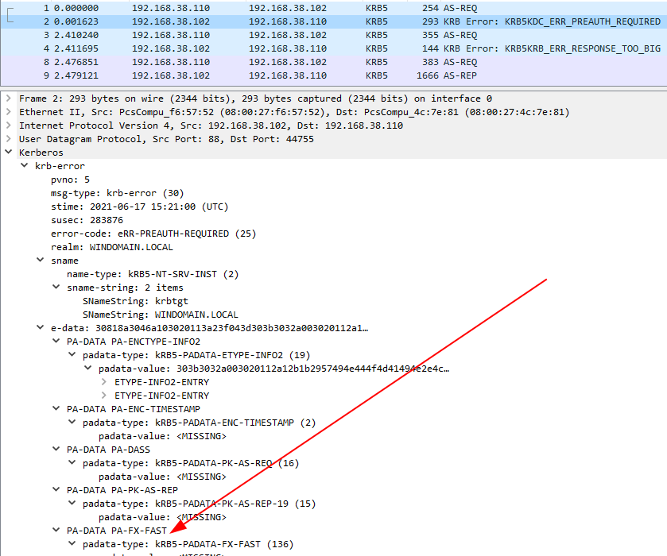
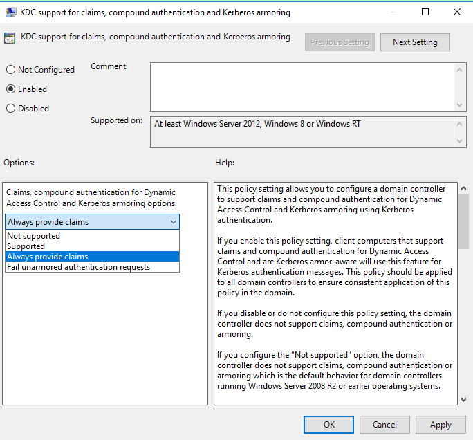
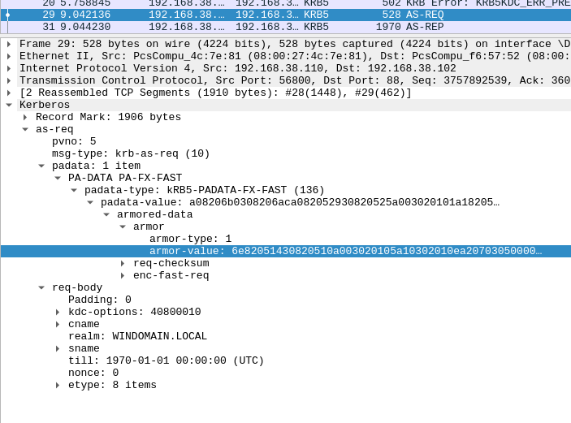
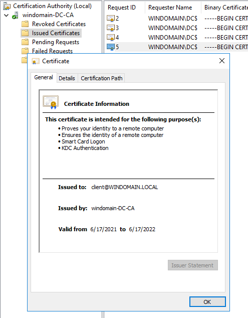
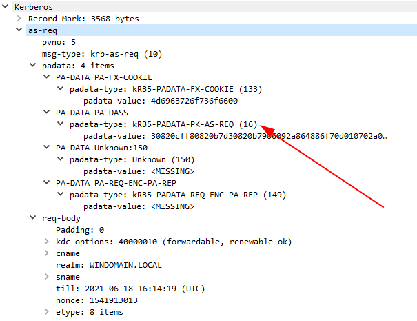
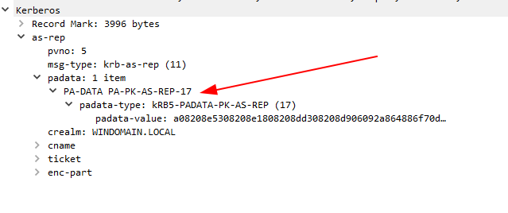

# Linux Compound-Authentication

## Objective

The [Tier-1 Administration through RestrictedAdmin lab](../admin-t1-restricted]) introduces [Authentication Policies](https://docs.microsoft.com/en-us/windows-server/security/credentials-protection-and-management/authentication-policies-and-authentication-policy-silos).

Briefly, theses policies use Kerberos Armoring (with the [FAST](https://datatracker.ietf.org/doc/html/rfc6113) pre-authentication data) to build compound authentication.

The device retrieves its TGT ticket, and this ticket is later used to armor the `AS_REQ` (request for a TGT) user request. That way, the KDC has cryptographic-based information on the user authentication source. With these information, the KDC is able to perform educated choice, such as "*allow the User `ADMIN` to retrieve a TGT only if it is connected on a computer belonging to the group `ADM_PCS`*".

This mechanism also works for `TGS_REQ` (request for service tickets).
Those mechanisms give the expressive power to describe powerful restrictions and security policies.

This lab highlights that this model also work with a Linux-based workstation, ie. **it is possible to perform compound authentication from a Linux-based computer**.

It then explores a few way of using it.

## Lab

This lab contains:
* A Win2016 domain "windomain.local" with:
    * Domain Administrator, password `vagrant`
* A Win2016 DC
* A Linux server `linux`, Alpine-based, using MIT Kerberos

## Setup

```
$ vagrant up dc
$ vagrant up linux
```

If one of the different machine does not setup correctly, one can `destroy` and re-`up` it, or try to re-provision it (`vagrant up MACHINE --provision`).

## Illustrating armoring

In the initial setup, the user `pikachu` has an associated authentication policy "Authent Policy", restricting him to only allow TGT request from the computer `CLIENT$`.


As a result, if one tries to perform a basic TGT request for `pikachu`:
```sh
# Connect to the Linux virtual machine
$ vagrant ssh linux
# Try to request a TGT
linux:~$ kinit pikachu
kinit: KDC policy rejects request while getting initial credentials
```

This [network capture](capt_fail_authpol.pcapng) illustrates it:


In order to make it work, we have to:

1. Request a TGT for `CLIENT$`
2. Use this TGT to armor the TGT request for `pikachu`

In this lab, `CLIENT$` is a computer with a trivial password `123456`. In the real world, Active Directory's computer passwords are randoms and unpredictable.

```sh
# Request a TGT for the CLIENT$ computer using password
linux:~$ kinit client\$
Password for client$@WINDOMAIN.LOCAL: 
linux:~$ klist
Ticket cache: FILE:/tmp/krb5cc_1000
Default principal: client$@WINDOMAIN.LOCAL

Valid starting     Expires            Service principal
06/17/21 15:21:44  06/18/21 01:21:44  krbtgt/WINDOMAIN.LOCAL@WINDOMAIN.LOCAL
	renew until 06/24/21 15:21:41
```

Looking at the corresponding [network capture](capt_success_authpol.pcapng), we can observe the *FAST* extension is negociated:



As a result, the armoring key will be computed by the client and save in the `ccache` file. According to the [documentation](https://web.mit.edu/kerberos/krb5-devel/doc/formats/ccache_file_format.html), this field is named `fast_avail`.

```sh
# Checking the presence of fast_avail
linux:~$ grep fast_avail /tmp/krb5cc_1000
Binary file /tmp/krb5cc_1000 matches
```

At the time of writing and according to the author's understanding, this behavior might depends on Kerberos implementation:

* in Heimdal (1.6), armor keys will always be computed in the `ccache`; but later, only the [Anonymous PKINIT](https://datatracker.ietf.org/doc/html/rfc6112) is supported. This is a no-go for our use case ;
* in MIT Kerberos (1.18), armor keys are only computed if the KDC explicitly announces its support.

The last point is relevant here. By default, if the support for Kerberos armoring is only *Enabled* on domain controllers, this announce will be missing. As a result, the armoring key **will not** be computed, and further armoring request impossible.

To tell the domain controller to annouce the support of `PADATA_FX_FAST`, the proper setting in the Group Policy is *Always provide claims*:



Note: if you do need to force FAST with a DC (for instance in a pentest), you can patch `krb5int_fast_verify_nego` in MIT Kerberos source code to force `fast_avail` to `True`.

Now that the Kerberos `ccache` contains a TGT and the corresponding armoring key for `CLIENT$`, it could be used to request a TGT for `pikachu` (password `Bonjour1!`):
```sh
# Keep the CLIENT$ ccache for later uses
linux:~$ mv /tmp/krb5cc_1000 /tmp/krb5cc_client
# -T indicates the armoring data
linux:~$ kinit -T /tmp/krb5cc_client pikachu
Password for pikachu@WINDOMAIN.LOCAL: 
# Success!
linux:~$ klist
Ticket cache: FILE:/tmp/krb5cc_1000
Default principal: pikachu@WINDOMAIN.LOCAL

Valid starting     Expires            Service principal
06/17/21 15:46:12  06/18/21 01:46:12  krbtgt/WINDOMAIN.LOCAL@WINDOMAIN.LOCAL
	renew until 06/24/21 15:46:07
```

Armoring is now used in the request, and the ticket is returned.



Long story short, if the domain controller is set to *Always provide claims*, armoring (so the compound authentication, so the authentication policy) will work with MIT Kerberos out-of-the-box.

## Authenticating CLIENT$ with a certificate

In the previous attempt, we used `CLIENT$`'s password to request a TGT for him. This is not the nicest way of doing it, and might expose this sensible secret.

Instead, one can use [PKINIT Kerberos](https://datatracker.ietf.org/doc/html/rfc4556) to request a TGT using a certificate instead of a password. A certificate is revokable, could have its secrets embedded in a secure element, ...

This authentication mode is [supported by Microsoft](http://msdn.microsoft.com/en-us/library/cc238455.aspx).

To do so, one needs a certificate with a CA trusted for authentication (ie. member of `NTAuthCertificates`).

In this lab, a PKI (ADCS) is running on `DC`. A certificate is issued to `client@WINDOMAIN.LOCAL` using a unsecure certificate template (`Kerberos Authentication Client`).
That certificate has the proper EKU (*Extended Key Usage*) to be used for SmartCard logon.



The setup script exports the certificate to the local file `mypfx.pfx`.

One can convert it to a `PEM` and upload it on `linux` VM using:
```sh
# Convert to PEM
openssl pkcs12 -in mypfx.pfx -out cert.pem --passin pass:dummypassword -passout pass:dummypassword
# Upload to 'linux'
vagrant upload cert.pem /home/vagrant/ linux
```

Thanks to a different `krb5.conf` configuration:

```config
[realms]
	WINDOMAIN.LOCAL = {
			pkinit_kdc_hostname = dc.windomain.local
			pkinit_anchors = FILE:/home/vagrant/cert.pem
            pkinit_identities = FILE:/home/vagrant/cert.pem
			kdc = 192.168.38.102:88
			default_domain = WINDOMAIN.LOCAL
	}
```

The certificate can be used for PKINIT kerberos (passphrase `dummypassword`):

```sh
# Ask a TGT using PKINIT kerberos
linux:~$ KRB5_CONFIG=/etc/krb5.pkinit.conf kinit client\$
Pass phrase for /home/vagrant/cert.pem: 
# Success!
linux:~$ klist
Ticket cache: FILE:/tmp/krb5cc_1000
Default principal: client$@WINDOMAIN.LOCAL

Valid starting     Expires            Service principal
06/17/21 16:13:14  06/18/21 02:13:14  krbtgt/WINDOMAIN.LOCAL@WINDOMAIN.LOCAL
	renew until 06/18/21 16:13:04
# Verify FAST has been negociated
linux:~$ grep fast_avail /tmp/krb5cc_1000
Binary file /tmp/krb5cc_1000 matches
```

The [network capture](capt_pkinit.pcapng) illustrates the process.

In the `AS_REQ`:



And the corresponding answer (`AS_REP`):



These fields are the one defined by the [RFC4556](https://datatracker.ietf.org/doc/html/rfc4556#section-3.1.3).

A decoded version is available on [this very useful website](http://aurelien26.free.fr/kerberos/05_pkinit/AS_REQ.html).

## References

* Parsed tickets: http://aurelien26.free.fr/kerberos/
* (French) Aurélien Bordes - [Kerberos contre-attaque](https://www.sstic.org/media/SSTIC2014/SSTIC-actes/secrets_dauthentification_pisode_ii__kerberos_cont/)
* [RFC4556](https://datatracker.ietf.org/doc/html/rfc4556) - Public Key Cryptography for Initial Authentication in Kerberos (PKINIT)
* [RFC6112](https://datatracker.ietf.org/doc/html/rfc6112) - Anonymity Support for Kerberos
* [RFC6113](https://datatracker.ietf.org/doc/html/rfc6113) - A Generalized Framework for Kerberos Pre-Authentication (FAST)
* CCache file format : https://web.mit.edu/kerberos/krb5-devel/doc/formats/ccache_file_format.html
* MSDN - [Domain-joined Device Public Key Authentication](https://docs.microsoft.com/en-us/windows-server/security/kerberos/domain-joined-device-public-key-authentication)
* MSDN - [[MS-PKCA]](https://docs.microsoft.com/en-us/openspecs/windows_protocols/ms-pkca/d0cf1763-3541-4008-a75f-a577fa5e8c5b)